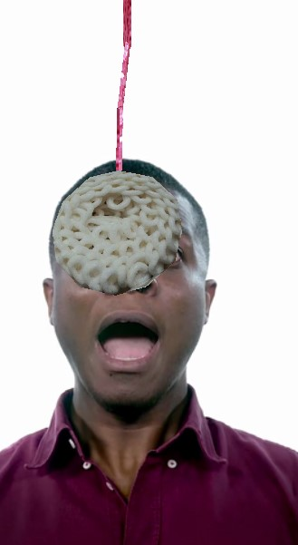
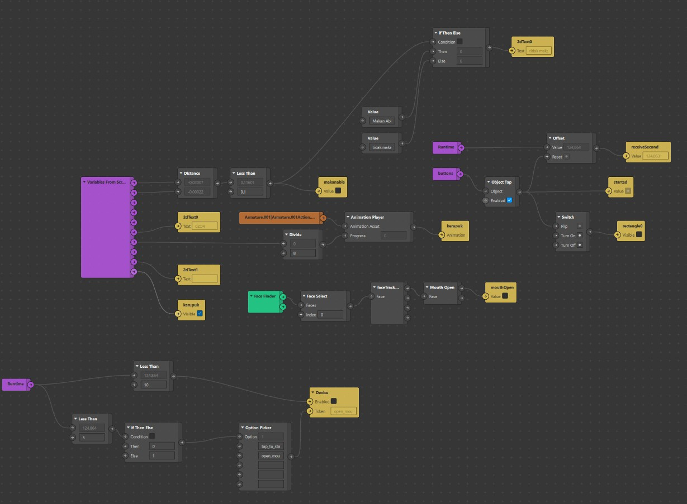

# Case Studies Spark AR Effect (Lomba Makan kerupuk) with cannon.js

First of, i have an idea to make one of anually race it's called (Lomba makan Kerupuk) for celebrate our independence day of our country. Since it still pandemic situation some of areas may cannot celebrate the moment so i decide for making this AR Effect and mocking like an real Lomba Makan Kerupuk.

But unfortunately due the short period for reviewing from Spark AR team, lack of FPS on Android Devices (even it have a high tier) and the lost of the moment, so i gave up and decide put this project on github for someone want to learning about SparkAR with cannon.js

## How the effect works

- Make sure to find a face to make effect works
- Crackers (Kerupuk) will hanging with a wire and showing in a front of your face, when you try move you head, position root of wire will moves to.
- Tap the screen for starts a game and the timer will appear.
- Put your mouth on the crackers and eat it until the crackers run out.

The effects logic is mostly happened in `main.js`

## Screenshoot

## Patches

